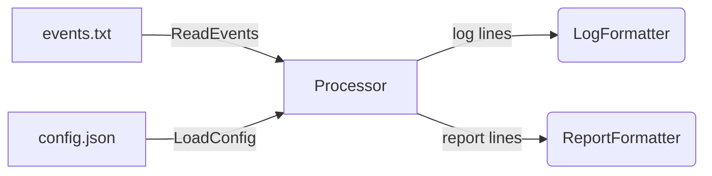
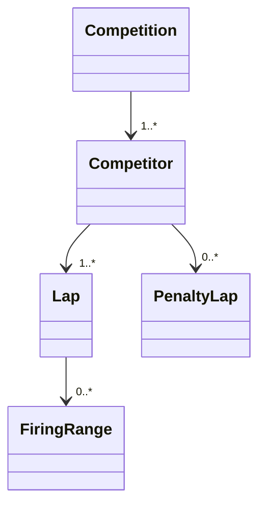

# 🏅 Прототип системы учёта биатлонных соревнований

---

## Содержание
1. [Task statement (EN)](#task-statement-en)
2. [Обзор реализации](#обзор-реализации)
    * [Слои архитектуры](#слои-архитектуры)
    * [Поток данных](#поток-данных)
3. [Доменная модель](#доменная-модель)
4. [Тесты и покрытие](#тесты-и-покрытие)
5. [Сборка и запуск](#сборка-и-запуск)
6. [Структура проекта](#структуxра-проекта)

---

## Task statement (EN)

<details>
<summary>полный текст задания</summary>

# System prototype for biathlon competitions
The prototype must be able to work with a configuration file and a set of external events of a certain format.
Solution should contain golang (1.20 or newer) source file/files and unit tests (optional)

## Configuration (json)

- **Laps**        - Amount of laps for main distance
- **LapLen**      - Length of each main lap
- **PenaltyLen**  - Length of each penalty lap
- **FiringLines** - Number of firing lines per lap
- **Start**       - Planned start time for the first competitor
- **StartDelta**  - Planned interval between starts

## Events
All events are characterized by time and event identifier. Outgoing events are events created during program operation. Events related to the "incoming" category cannot be generated and are output in the same form as they were submitted in the input file.

- All events occur sequentially in time. (***Time of event N+1***) >= (***Time of event N***)
- Time format ***[HH:MM:SS.sss]***. Trailing zeros are required in input and output

#### Common format for events:
[***time***] **eventID** **competitorID** extraParams

```
Incoming events
EventID | extraParams | Comments
1       |             | The competitor registered
2       | startTime   | The start time was set by a draw
3       |             | The competitor is on the start line
4       |             | The competitor has started
5       | firingRange | The competitor is on the firing range
6       | target      | The target has been hit
7       |             | The competitor left the firing range
8       |             | The competitor entered the penalty laps
9       |             | The competitor left the penalty laps
10      |             | The competitor ended the main lap
11      | comment     | The competitor can`t continue
```
An competitor is disqualified if he/she does not start during his/her start interval. This marked as **NotStarted** in final report.
If the competitor can`t continue it should be marked in final report as **NotFinished**

```
Outgoing events
EventID | extraParams | Comments
32      |             | The competitor is disqualified
33      |             | The competitor has finished
```

## Final report
The final report should contain the list of all registered competitors
sorted by ascending time.
- Total time includes the difference between scheduled and actual start time or **NotStarted**/**NotFinished** marks
- Time taken to complete each lap
- Average speed for each lap [m/s]
- Time taken to complete penalty laps
- Average speed over penalty laps [m/s]
- Number of hits/number of shots

Examples:

`Config.conf`
```json
{
    "laps" : 2,
    "lapLen": 3651,
    "penaltyLen": 50,
    "firingLines": 1,
    "start": "09:30:00",
    "startDelta": "00:00:30"
}
```

`IncomingEvents`

```
[09:05:59.867] 1 1
[09:15:00.841] 2 1 09:30:00.000
[09:29:45.734] 3 1
[09:30:01.005] 4 1
[09:49:31.659] 5 1 1
[09:49:33.123] 6 1 1
[09:49:34.650] 6 1 2
[09:49:35.937] 6 1 4
[09:49:37.364] 6 1 5
[09:49:38.339] 7 1
[09:49:55.915] 8 1
[09:51:48.391] 9 1
[09:59:03.872] 10 1
[09:59:03.872] 11 1 Lost in the forest

```

`Output log`
```
[09:05:59.867] The competitor(1) registered
[09:15:00.841] The start time for the competitor(1) was set by a draw to 09:30:00.000
[09:29:45.734] The competitor(1) is on the start line
[09:30:01.005] The competitor(1) has started
[09:49:31.659] The competitor(1) is on the firing range(1)
[09:49:33.123] The target(1) has been hit by competitor(1)
[09:49:34.650] The target(2) has been hit by competitor(1)
[09:49:35.937] The target(4) has been hit by competitor(1)
[09:49:37.364] The target(5) has been hit by competitor(1)
[09:49:38.339] The competitor(1) left the firing range
[09:49:55.915] The competitor(1) entered the penalty laps
[09:51:48.391] The competitor(1) left the penalty laps
[09:59:03.872] The competitor(1) ended the main lap
[09:59:05.321] The competitor(1) can`t continue: Lost in the forest
```

`Resulting table`
```
[NotFinished] 1 [{00:29:03.872, 2.093}, {,}] {00:01:44.296, 0.481} 4/5
```
</details>

---

## Обзор реализации

### Что выполнено

| Требование | Выполнение |
|------------|------------|
| Строгое чтение/валидация JSON-конфига | `internal/config` |
| Парсинг потока событий, генерация 32/33 | `internal/io`, `internal/domain` |
| Учёт промахов, лимит огневых рубежей | `domain.Competition` |
| Поддержка перехода через полночь | `dayOffset` |
| Дисквалификация за пропуск старта | `Competition.AtEnd()` |
| Лог в точности как в примере | `formatter.LogFormatter` |
| Итоговый отчёт со всеми метриками | `formatter.ReportFormatter` |
| Unit-тесты ≥ 95 % | 97 % (см. далее) |

### Слои архитектуры

cmd/ → CLI (flags)
internal/
config/ → JSON + валидация
domain/ → чистая бизнес-логика
service/ → склейка IO ↔ domain
formatter/ → рендеры лога и отчёта
io/ → файловые адаптеры
util/ → time/regex helpers

В `domain` – ни строчки `os`/`log`, можно переиспользовать в сервисах или GUI.

### Поток данных



### Доменная модель

**Каждый FiringRange всегда содержит 5 выстрелов; промахи = 5 − попаданий.**

### Тесты и покрытие 

| Пакет                | Покрыто | Комментарий                     |
| -------------------- | ------: | ------------------------------- |
| `internal/config`    |   100 % | edge-кейсы JSON                 |
| `internal/domain`    |    96 % | финиш, штраф, полночь, overflow |
| `internal/util`      |    96 % | парсинг времени, regex          |
| `internal/io`        |   100 % | чтение/запись файлов            |
| `internal/formatter` |    95 % | шаблоны строк                   |

```bash
go test ./... -coverprofile=cover.out
go tool cover -func=cover.out | tail -n1
# total: (statements) 97.4%
```
**Unit-тесты лежат рядом с исходниками; интеграционные – в каталоге tests/.**

### Сборка и запуск

```bash
# 1. сборка статического бинарника
go build -o bin/biathlon ./cmd

# 2. запуск на примере
./bin/biathlon \
    -config examples/config.json \
    -events examples/events.txt \
    -log    out.log \
    -report result.txt
```

**Флаг - вместо имени файла ⇒ stdin/stdout.**

### Структура проекта

```csharp
.
├── cmd/                  # точка входа
├── internal/
│   ├── config/           # конфиг
│   ├── domain/           # бизнес-логика
│   ├── formatter/        # строковые рендеры
│   ├── io/               # файлы
│   ├── service/          # оркестратор
│   └── util/             # хелперы
├── tests/                # интеграционные сценарии
├── examples/             # готовые config + events
└── README.md
```

<p align="center"><sub>© 2025 Miraines • MIT License</sub></p>